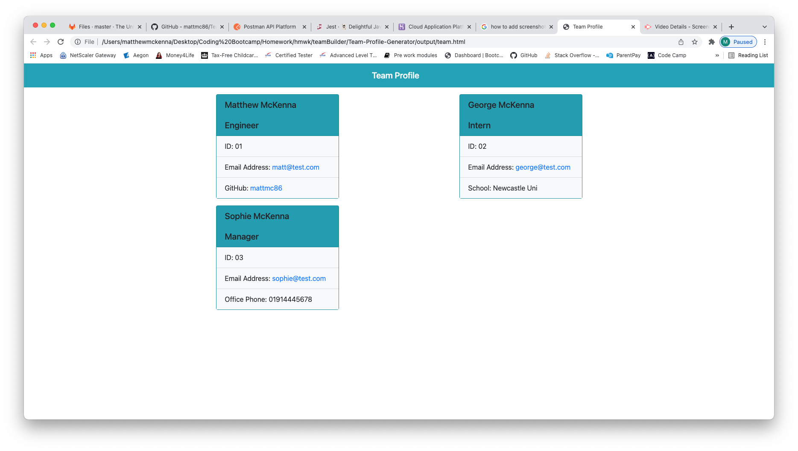

# Team-Profile-Generator
  
  
  ## Description
  
  
   This is a node.js program using inquirer which will prompt the user to input team members details and on completion will generate an HTML file with the inputs
   
  ## Table of Contents
  * [Installation](#installation)
  * [Usage](#usage)
  * [License](#license)
  * [Tests](#tests)
  * [Questions](#questions)
  
  ## Installation
  npm i npm inquirer npm jest
  ## Usage
  to use run node index.js command, then enter team members name, ID, email address and role. If the role is Engineer then add github username, if the role is intern then add the school they attended or if the role is Manager then the office phone number - after each member is added the user can select Yes or No to enter more members - after the last one is done select No.
  Video instructions can be viewed here: https://watch.screencastify.com/v/Ikqep7OMOV2rYUPnSLTA
  ## License
  https://opensource.org/licenses/MIT
  This project is under the license of MIT
  
  ## Tests
  npm run test - jest must be installed before running tests.
  ## Questions
  If you have any questions about this project, you can contact me at matthewmckenna1986@hotmail.com. More projects available here https://github.com/mattmc86.

